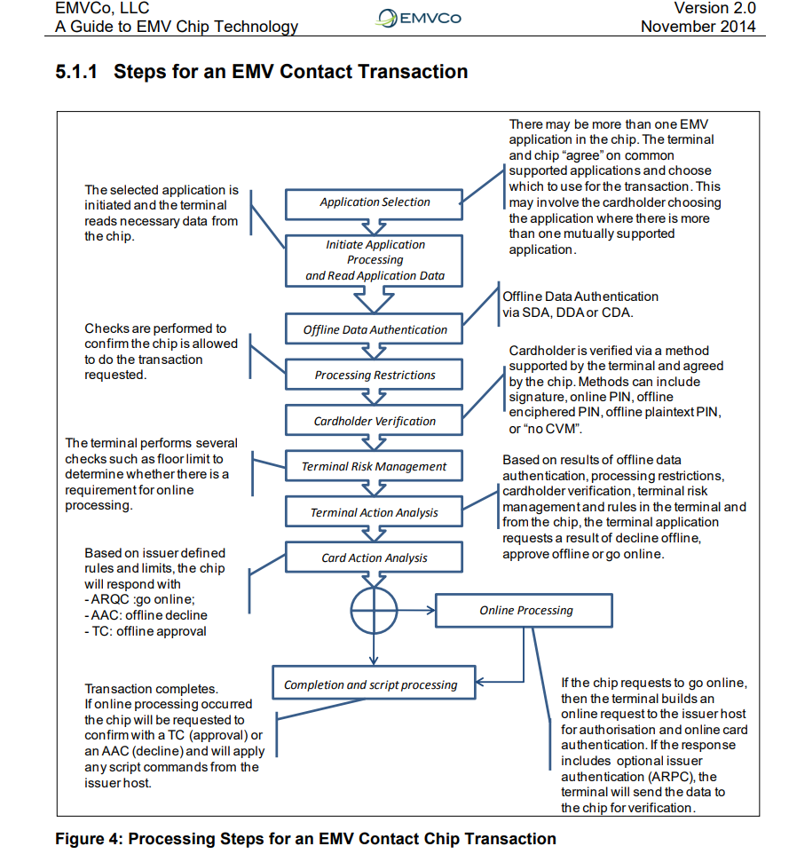

# EMV - Europay Mastercard Visa

## What is secure EMV chip?
The payment application is resident in a secure chip that is embedded in a plastic payment card

The secure chip provides three key elements:
* it can perform processing function
* it sis able to store confidential infroamtion very securly
* it can perfoem cryptographic processing

credit vs debit

ale nie ma baterii dlatego podbnie jak w tagach nfc eneria jest przekazywana z tyerminala do karty płatniczej,
np jakieś rzeczy które wymagają jakiejś szyfrowania

np niektózy maja ustawione limity na koncie jezeli by były one egzekwowane po stronie terminala a nie karty mogłoby to sprawić że dowolny terminal mółby oszukać kartę mówiąc że nie potrzebuje ona pinu

* pin - verifining identity
* offline data authentication
* onlinne authorizaiiopnj
* sprawdzanie limitów na konici
SDA
DDA
CDA

ale jeżeli karta zostanie zgubiona to i tak mamy lipe cn?

dlaczego karta jest własnością santander bank polska a nie posiadacza

terminal provides power to chip

thie chip cards that support both contact and contactless interfaces are referred to as dual interface

unterfeit- fałszerstwo

SS7/mozna zapytać gdzie jest człowiek

kody USSD

bramka SMS

jak naprawdze działają fale radiowe i jak to jest że można je nasłuchiwać na określonych częstotliswosćiach

komu się to opłaca kto dostaje za to pieniądze

swift

## The specific features defined by EMVCo that achieve the protections and controls to reduce counterfeit and lost and stolen card fraud

