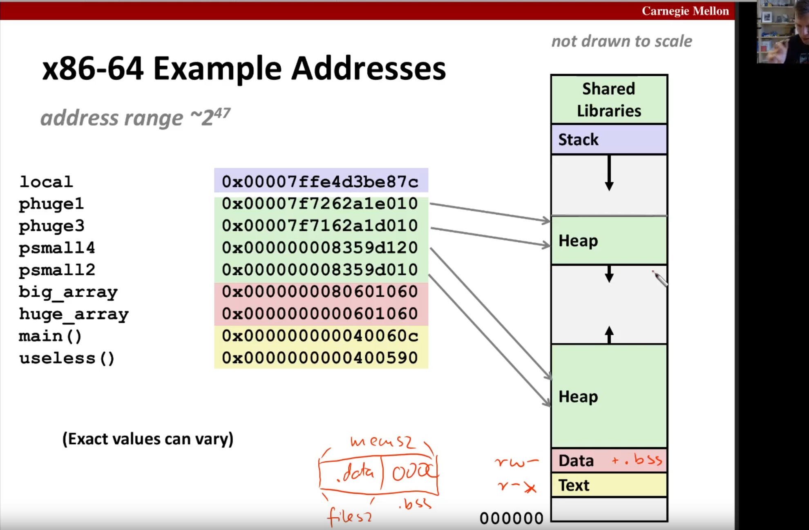

# arrays 

> [!NOTE]
> Memory is addressed with bytes

`int val[5] = {1,2,78,100,10};`\

| in-code | in-assembly |
| ------- | ----------- |
| val+1   | val +4      |
| &val[2] | val + 8     |

> [!CAUTION]
> `int *a[10]` vs `int (*a)[10]`\
> `int* a[10]` is an array of 10 pointers to integers\
> `int (*a)[10]` is a pointer to an array of 10 integers

> [!NOTE]
> there are adventages of using fixed size arrays (multidimentional) because compiler can create more efficient code. By faster multiplication. e.g.\
> `T A[i][j]` insted of using `sizeof(T)*i + j` with `imul` it would use some `salq` and `leaq` opts

## sizeof alignof offsetof

### alignof(some_struct or primitive type or array)
takes the minimum primituve subtypre recursively, tells 

> [!NOTE]
> every type has to start at some multiplicity of its size. For example int can be only at positions divisible by 4\
> the padding in the end of some stucter has to be aligned to the max of alignof its variables

## floating points in assembly

we have 16 `%xmmi` registers (from `%xmm0` to `%xmm15`)

> [!NOTE]
> all `%xmmi` registers are caller-saved, which means that a function can modify them, and a caller ahve to save it on a stack

> [!NOTE]
> pamięć w rejstrach z pamieci jest odwracana tak zeby była logiczna!

each register has 16 bytes

we can use register as a vector of floats or as a one big float

### addition
`addss` add **s**calar **s**ingle precision
`addps` add **p**ararel **s**ingle precision
we have allso **double** prevcsionson

`movapd` -  Move Aligned Packed Double Precision Floating-Point Values

`movups` - moves unaligned packet signle precision (but four of them so moves double quadword)

`movdqa` - moves aligned double quadword
