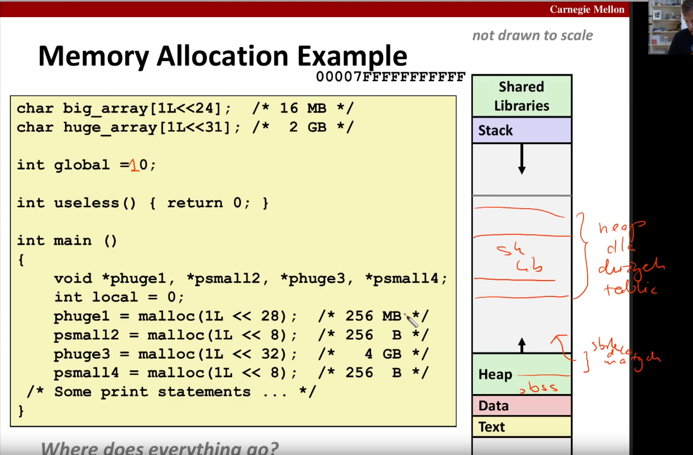
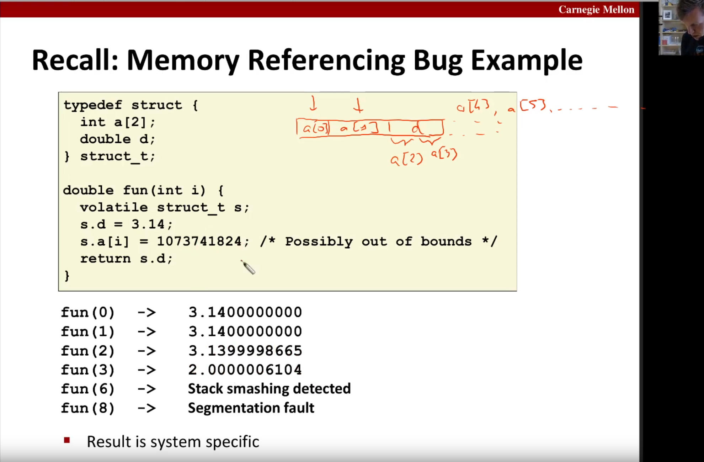
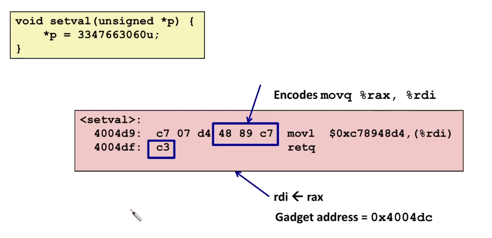
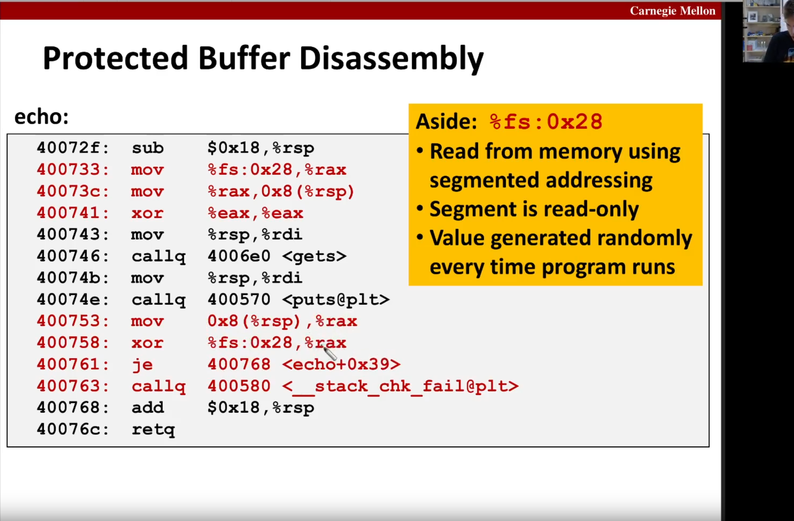

# attacks

## memory layout

* every process has its own memory space
  
  

> [!WARNING]
> why `.text` data doesn't start from `0x0000` address space?
> beacause we want to forbid usage of unallocated pointers\
> **e.g. :**
> ```
> char *p;
> cout << p[100]
> ```

> [!NOTE]
> `pmap` - report memory map of a proces
>
> `pmap $$`

> [!NOTE]
> data on stack isn't cleared. If some variable is on a stack it means and its not initialized it can have any value

## memory allocation


> TODO:[]
> segment vs section
>

Memory reference bug example

> [!NOTE]
> notice that memory is little endian in computer therefore in struct `a.d[2]` we will overwrite the mantis (least significat bytes in the `double`)


> [!NOTE]
> `volatile` keyword can be used to compel the assembler to put sth into a stack
> ```
> typedef struct {
>     int a[2];
>     double x;
> } S;
> 
> double func(int i){
>     volatile S temp;
>     temp.x = 3.14;
>     temp.a[i] = 123331123;
>     return temp.x;
> }
> ```


## memory attack

* buffer overflow - code injection
* buffer overflow - return orientated programming with gadgets - few instructions ending with `ret`

> [!NOTE]
> gadgets can start from in the middle of some instruction, and doesn't have to end with ret maybe this instruction will have `c3` in between
>  

> [!NOTE]
> `retq` is encoded with `0xc3`

> [!NOTE]
> exists also buffer underflow, but it is harder to execute beacuse commonly retur address is above arrays


> [!NOTE]
> TODO:?
> stack grows up and right
> once again:\ 
> **why little endian?**

how to avoid attacks:
* `gets` -> `fgets`
* `strcpy` -> `strncpy`
* `scanf("%s",buff)` -> `fgets` | `scanf("%12s", buff)`

> [!NOTE]
> `gcc -fstack-protector` enables canaries


## making memory attack useless techniques:
* canary
    
* random stack position and other section