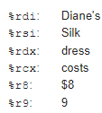

# commands AT-NT
<!-- ## data transfer
* mov
* cbw / cwde / cdqe
* cwd/cdq/cqo
* movzx
* movsx -->

## mov**q**

| mnemonik | suffix   | operands    |
| -------- | -------- | ----------- |
| movq     | mov**q** | soure  dest |

> suffixes: **q**uadword, **l**ongword, **w**ord , **b**yte

operand types of move: 
* const (called emidate) (with **$**): `$0x4000`
* register - value of register example: `%rdx`
* memory: `(%rax)`
> [!NOTE]
> const value can be used with 1,2,4 bytes mov mnemonics (`movb`, `movw`, `mov`). If you want to use 8 byte mnemonic with constant you have to use `movabsq`

> [!NOTE]
> its not possible to make a transfer from memory and to memory at once using `mov`

<!-- TODO: co się stanie jak wrzucimy do movl stałą większą niż 4 bajty -->

## simple memory addressing modes

`D=0(Rb,Ri,S=1)`\
`D(Rb,Ri,S)`

> it is useful to simple types array iteration

Rb - base {any register}
Ri - index in array {any register}
S - scale {1,2,4,8}
D - offset {1,2,4}

## arguments ordering

## little endian vs bigendind - byte ordering

let put a `int32_t` to a memory: `0x12345678`

> it only revelant when storing multipbyte quantity

intel 0x86-64 uses little endian adressing
   
| address | little endian | big endian |
| ------- | ------------- | ---------- |
| 100     | 78            | 12         |
| 101     | 56            | 34         |
| 102     | 34            | 56         |
| 103     | 12            | 78         |

## lea**q**

it works the same as movq but doesn't make dereference

> `lea` returns a value after one clock cycle
> and `imulq` returns val in 3 clock cycle (but is piplined). 
> So instead of executing imuq sometime it is faster to use `lea`
>
> `x*12` | `leaq (%rdi, rdi,2), %rax; salq $2, %rax` 

## another instructions

* `salq` - shift arithmetic left
* `addq` - addition
* `shr` - shift arithmetic right
* `sar` - shift logical right
* `and` `or` `xor`

<!-- TODO: jak dizała mnożenie na intach które są signed vs unsinged -->

* `incq` - increments by one
* `decq` - decrements by one
* `negq` - negation
* `notq` - not

## turning C into executable

C
>compilation

Assembler

>assembler

binary - object
> linking -consolidar

binary - executable

> [!NOTE]
> Memory is addresed by bytes