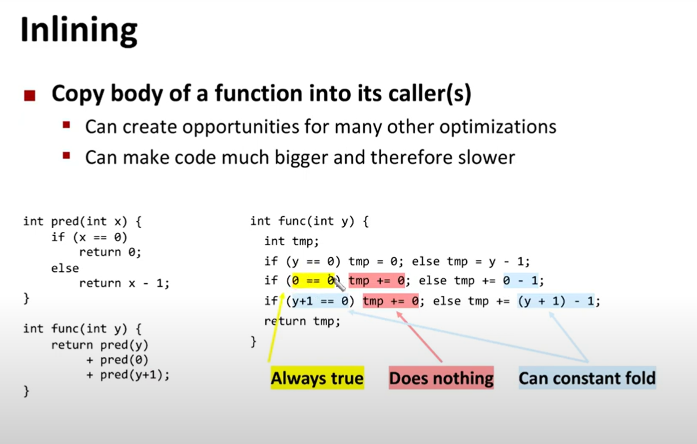
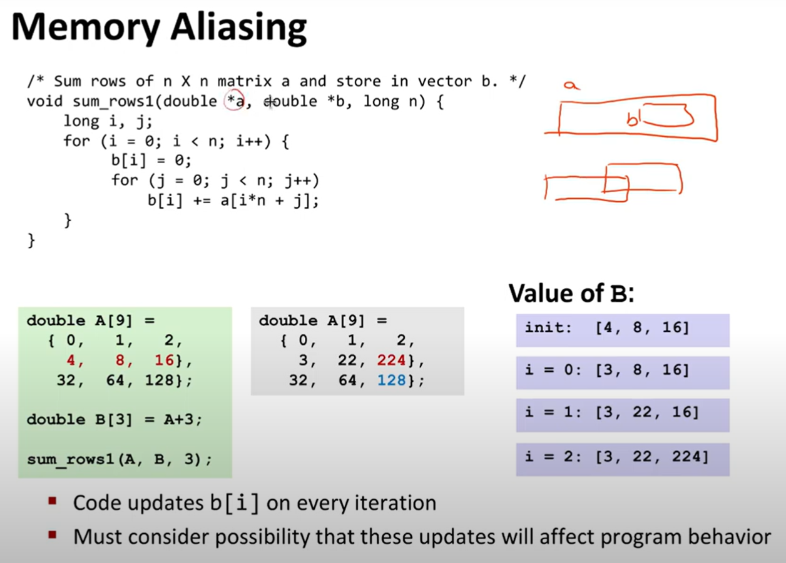
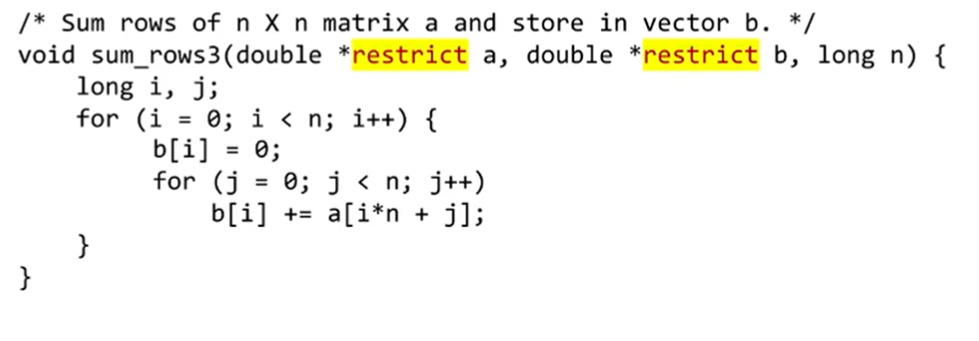

# optimalization

> [!NOTE]
> `undefined behaviour` is great. Because compiler can optimize code in a way that output could be changed, and everything is ok.

optimalization are executed within a module

profile guided optimalization - when we measure which branches of the code are used most commonly and we help procesor to optmize this cases.

function inlining can facilitate optimalizaiton of code:

memory aliasing:
- when we operate on data sets whose common part is non-zero

> [!NOTE]
> how to explain to the compiler that data sets have no commont parts
> `restrict` keyword:
> 

* compiler cant move function calls out of loop

> [!NOTE]
> `retirement unit` is responsible for retriving sequential instruction set
> 

> [!NOTE]
> `procesor superscalarny` taki który może wykonywać wiele operacji jednoczenie

> [!NOTE]
> instruckje są potokowane: jedna instrukcja może trwać 3 cykle ale kilka z nich moze sie wykonywać jednoczenie
> dlatego warto wyplaszczac `data-flow` (graf przepływu danych) 

- branch prediction - alows to upload instruction faster and upload nneded data cells

- `reorder buffer` - during the predictions of jumps computer may execute unwanted instructions, in the speciall unit of procesor he keeps finished instruction, but attaches to them special flag when he is not sure that they are wanted