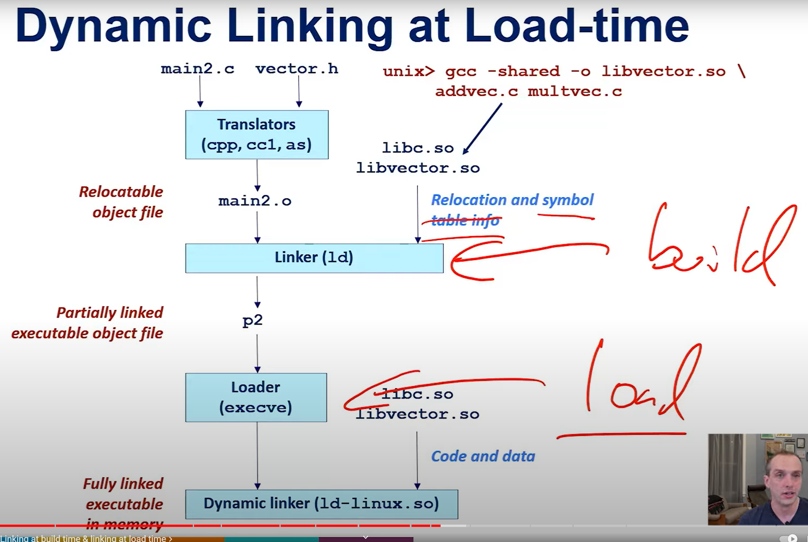
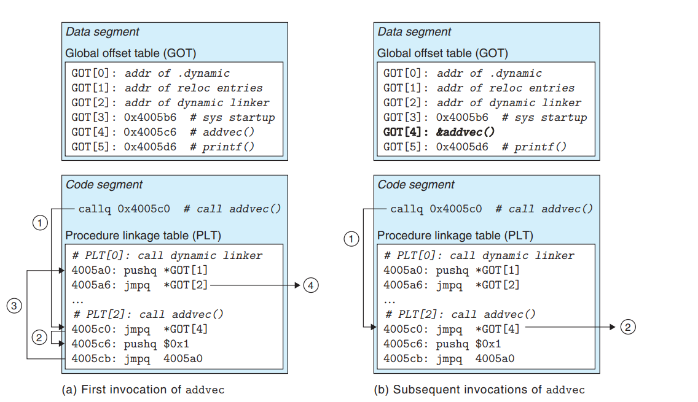

# elf format again

types of elf file:
* relocable
* executable
* shared libraries

## structure of ELF 
1. ELF header
2. ELF data (section and segments)
   

## elf header

`readelf -h file.o` - parsing elf header
* magic bytes
* class - 32bit(=01) or 64bit(=02)
* data - endiannes - little(=01), big(=02)
* version of elf (only `01` is handled)
* ABI (SystemV = 00 used when comiled dynamicalyy) or (Linux = 03)
* ABI version (00) -almost never used
* padding (7 bytes filled with zero)
* (from the 16th byte) type:
  * CORE (value 4)
  * DYN - when linked dynamically (value 3) 
  * EXEC - when linked statically (value 2) (`--static`)
  * REL (Relocatable file), before linked into an executable file (value 1) (`-c`)
* Machine (architecture)
* version (always `01 00` - 2 bytes)
* Entry point
* ...
* elf header size (which is also fixed value)
* ... 
* section header string table (`.shstr` position)

## Program headers (or Segements) - important at runtime
  Each segment is defined by program header. Program headers are consecutivelly put next to each other in ELF file ant its position depnds on `elfheader filed`

  from [github.com](https://github.com/compilepeace/BINARY_DISSECTION_COURSE/blob/master/ELF/PROGRAM_HEADER_TABLE/PHT.md?plain=1)
  |           TYPE           | DESCRIPTION                                                                                                                                                                                                                                                                          |
  | :----------------------: | :----------------------------------------------------------------------------------------------------------------------------------------------------------------------------------------------------------------------------------------------------------------------------------- |
  |      PHDR / PT_PHDR      | It is the first entry specifying the **PHT** itself. (We can ofcourse write a linker script to add new segments and place any section into our desired segment). We can even omit this segment but if this segment is present, it should be placed above any loadable segment entry. |
  |    INTERP / PT_INTERP    | This segment stores a NULL terminated string indicating the location of the interpreter program. It should be placed above any loadable segment entry.                                                                                                                               |
  |      LOAD / PT_LOAD      | This type of segment hold the sections which will get loaded into the process address space when the program executes. Loadable segment entries in PHT appear in ascending order sorted by 'p_vaddr' member.                                                                         |
  |   DYNAMIC / PT_DYNAMIC   | specifies that this segment will store the dynamic linking information (i.e. the `.dynamic` section)                                                                                                                                                                                 |
  |      NOTE / PT_NOTE      | Specifies the location of auxiliary information (notes).                                                                                                                                                                                                                             |
  |       GNU_EH_FRAME       | Exception Handling frame.                                                                                                                                                                                                                                                            |
  | GNU_STACK / PT_GNU_STACK | This is a GNU extension used by the kernel to control the stack functionality by the segment flags set in *p_flags* member of struct 'Elf65_Phdr'                                                                                                                                    |
## program sections - at link time

* `.dynamic` contains:\
    * Library names
    * Symbol tables
    * Relocation tables
    * Initialization and finalization functions
    * Addresses of the GOT
    * Addresses of the PLT
    * Other dynamic linking informatio

* `.strtab`:\
  its a list of null-terminated consecutive strings that are used as symbol names in other sections. Sections like `.symtab` and `.dynsym` reference that table by specifing offset for referencing symbol names (like `printf`)

* `.shstrtab` (section header string table):
  contains the name of each section header which, as above, in section header is specified by offset
  (section header has fixed length, so we have to `allocate` space for a string)

* `.interp`
  * **Program Execution:** When the operating system loads an ELF executable, it checks for the presence of the `.interp` section.
  * **Interpreter Path:** If the `.interp` section is present, the `OS` reads the path to the interpreter specified in this section.
  * **Loading the Interpreter:** The `OS` then loads the specified interpreter and passes control to it. This interpreter is responsible for loading the necessary shared libraries, resolving symbols, and preparing the program for execution.
  * **Dynamic Linking:** The interpreter uses the information in other sections (like .dynamic, .got, .plt) to perform dynamic linking. It resolves addresses of shared library functions and variables, updates the GOT, and ensures the executable is ready to run.

* `.plt`
  The PLT consists of code that is used to call external functions. When a function in a shared library is called for the first time, the corresponding PLT stub will invoke the dynamic linker, which resolves the function's address and updates the GOT. Subsequent calls will directly use the resolved address from the GOT.

* `.got`
 The GOT contains addresses of global variables and function pointers. It is updated by the dynamic linker at runtime to point to the correct locations of variables and functions in shared libraries.

> [!NOTE]
> segments have information about where they should be put at virtual memory and about `RWX` priviledges 

> [!NOTE]
> dynamic linker (interpreter) uses `/etc/ld.so.conf` file in order to get information about where shared libraries are located in the filesystem
> you can read more about it in `ldconfig` manual

> [!NOTE]
> when loading a library we load `.text` and `.data` of that library into out memoery space

> [NOTE]
> `.interp` - specify interpreter paths
>
> by default dynamic linkers would work lazy
> to make it work eager on linux you can provide 
>
> `LD_DEBUG=all LD_BIND_NOW=TRUE prog`

## lazy binding

> [!NOTE]
> `PLT[0]`  calls dynamic linker:
> * by providing reloc entry argugument (by stack)
> * and by jumping to `*GOT[2]`, which is the addr of dynamic linker

> [!NOTE]
> `GOT[i]` entry (e.g. entry for `printf`) is initialized with second instruction in corresponding plt (`pritnf@plt`)
> dynamic linker changes `GOT[i]` to the position of loaded from shared libnrary `printf`

# bibliography

https://linux-audit.com/elf-binaries-on-linux-understanding-and-analysis/\
https://www.youtube.com/watch?v=nC1U1LJQL8o&list=PLuJ9u3pztP-1SsV20Rv7FK8jf9uQjN3T-
https://www.cs.sfu.ca/~ashriram/Courses/CS295/assets/books/CSAPP_2016.pdf