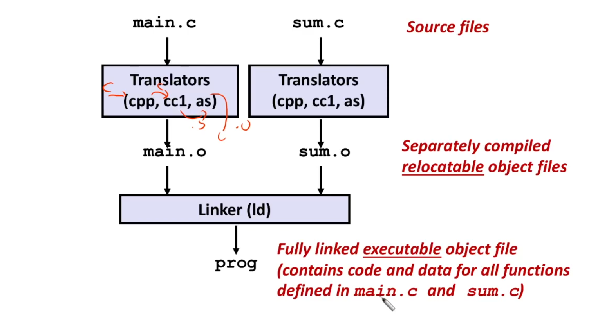
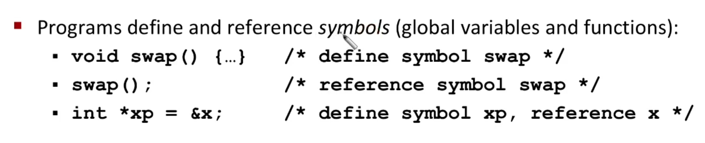
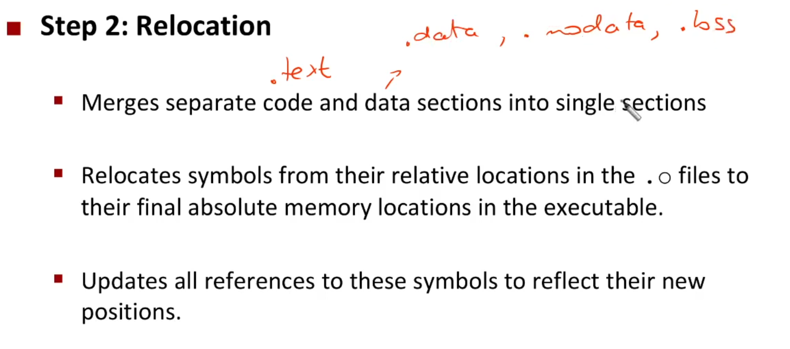
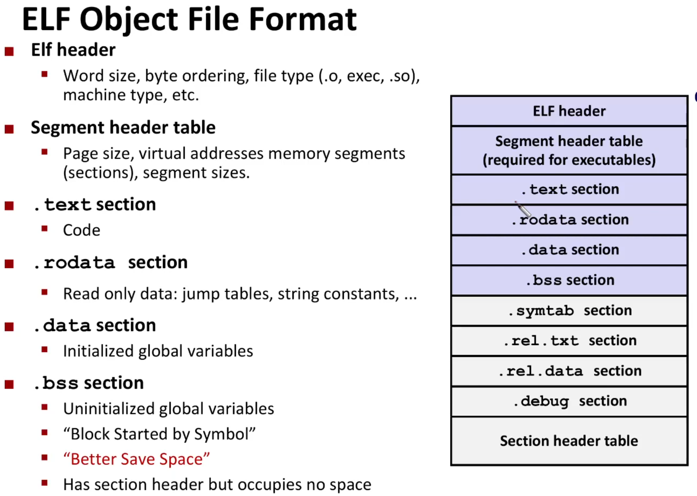
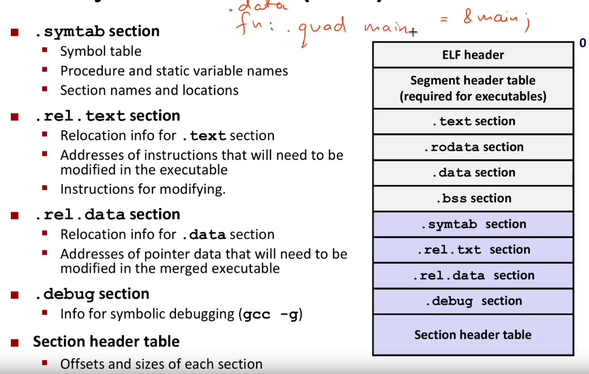
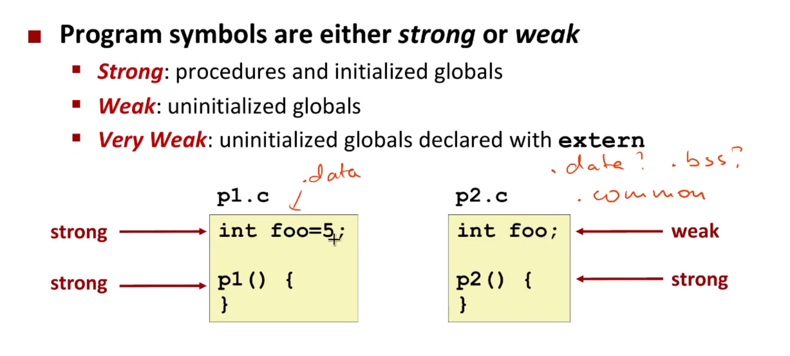
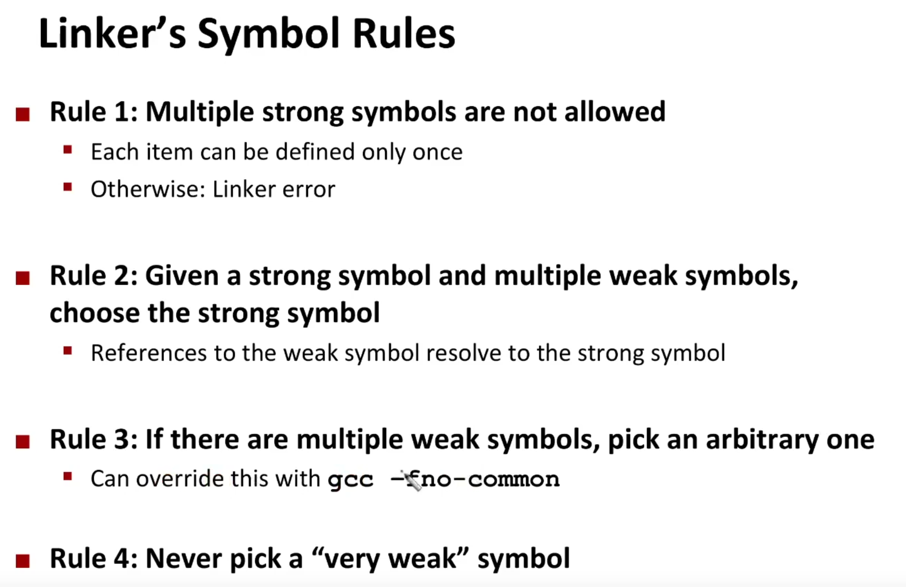
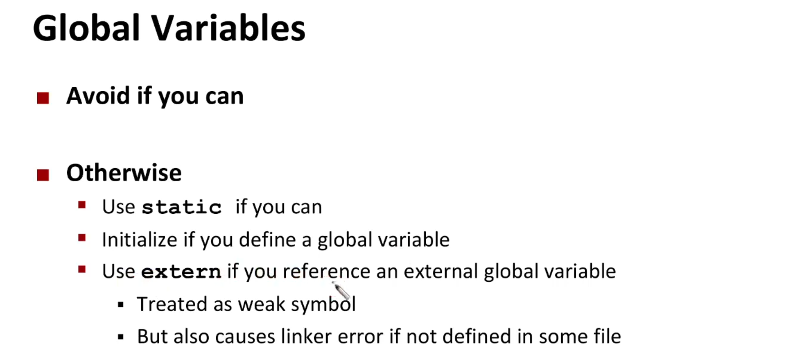

# consolidation - linking

## how program compiles

* how and why we have many translation units?
* gcc is `sterownik kompilatora`
* main function is not the first function that is called during code execution - start is

## why do we need linkers - modularity
1. we don't need to recompile all code, just one translation unit
2. we can create shared librires - which safe space in disk
3. we can compile multiple files concurrently `make -j $(nproc)`

##  two types of linking:
* static linking - the code can run on its own, without the need for external libraries (after the compilation)
* dynamic linking
  * executable files contain no library code, therefore they need for external libraries during execution
  
## what do linkers do?
* symbol resolution - symbol references to some memory
`
* relocation
  

> [!NOTE]
> `nm` print symbols from object files
> `readelf main.o`

> [!NOTE]
> `objdump -dr main.o`

> [!WARNING]
> `.L2(%rip)` means that after linking phase we will receive insted of `.L2` relative address ti `.L2` from `%rip`

## how ELF file looks like

We have 3 types of ELF files:
* relocative
* executable
* shared libraries

> [!NOTE]
> `.bss` section instead of 5 mb of unitialized spaced (filled with zeros) its a header with inforamtion that 5mb of zeros is needed

> [!NOTE]
> don't forget about relocation record that are needed to relocate `.L2(%rip)`, which looks like this in `objdump`:
> 
> each section has `.rel` prefix

## how linker resolves duplicate symbol definitions

### conclusion - consolidator is stupied (it useful but its not smart)
[linker-is-not-a-magical-program](https://97-things-every-x-should-know.gitbooks.io/97-things-every-programmer-should-know/content/en/thing_53/)
> A linker is a very stupid, pedestrian, straightforward program. All it does is concatenate together the code and data sections of the object files, connect the references to symbols with their definitions, pull unresolved symbols out of the library, and write out an executable. That's it. No spells! No magic! The tedium in writing a linker is usually all about decoding and generating the usually ridiculously overcomplicated file formats, but that doesn't change the essential nature of a linker.

