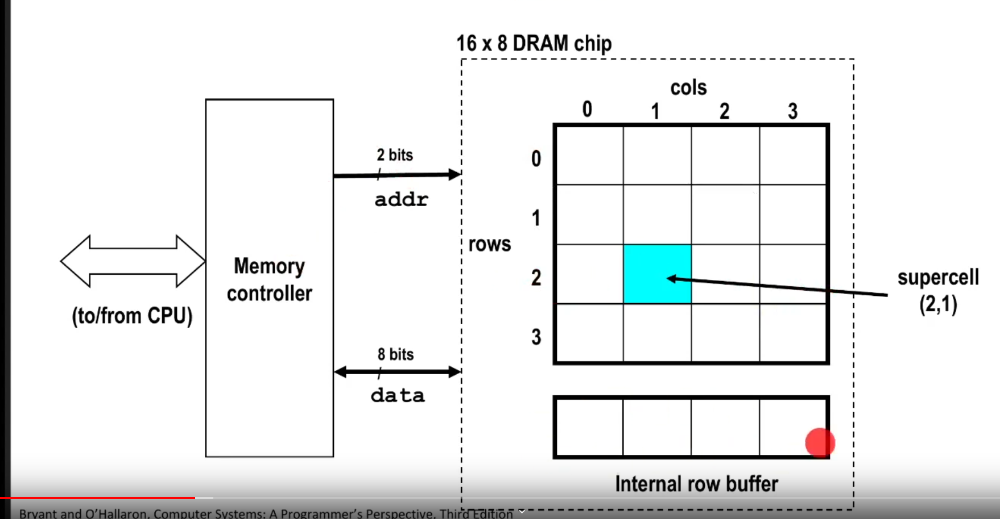
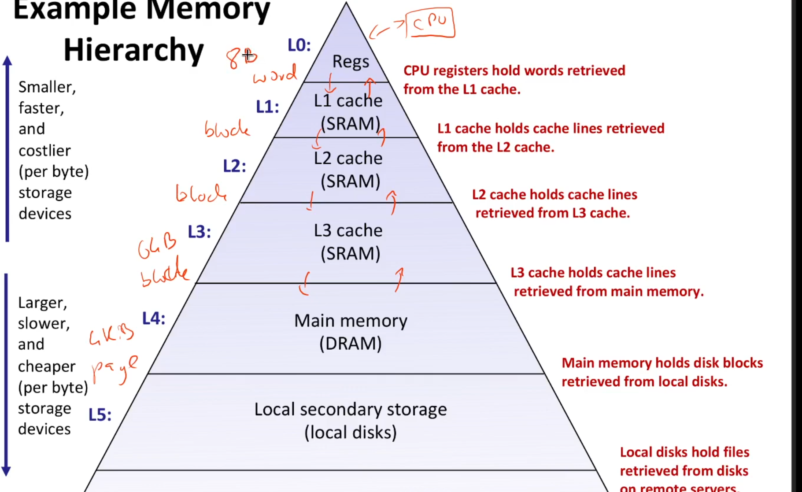
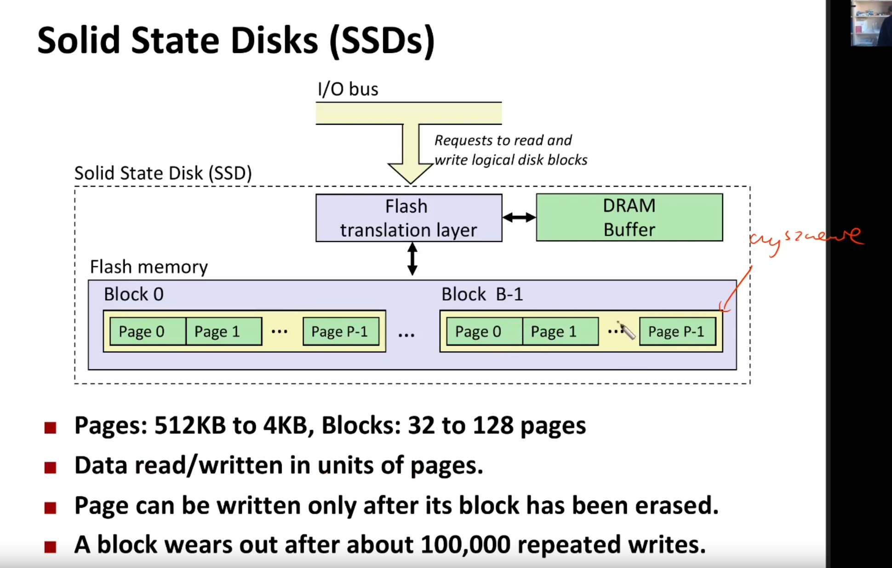

# memory abstraction

> [!NOTE]
> `magistrala/szyna` - za jej pomocą procesor komunikuje się ze światem zewnętrznym

> [!NOTE]
> procesory, aby wykonać instrukcje, korzystają z sygnału synchronizującego, który cyklicznie zmienia 1->0 i 0->1. \
> Każda kolejna wykonana instrukcja jest inicjowana zmianą sygnału zegarowego (z zera na jeden). Niektóre instrukcje mogą trwać jednak kilka cykli zegarowych, gdzie cykl zegarowy to zmiana to `/¯\_`;

> [!NOTE]
> szyny mają określoną przepustowość - o którą konkurują różne komponenty komputera. np:
> * różne rdzenie procesora
> * karta graficzne
> * etc

> [!NOTE]
> w szynach słowo maszynowe może być przesyłane w sposób równoległy, czyli każdy bit słowa w innm kablu lub  szeregowy: bit po bicie. Większość współczesnych szyn jest szeregowych :O 

## RAM - Random Access Memory
types of ram 
* static ram (cache)
  * inside procesor
  * expensive and fast
* dynamic ram (ddr4)
  * outisde procesor
  * cheaper, but slower
  * must refreash state periodically

## RAM organization (uni model)

memory is organized in supercells of some size in each cell of supercell is one byte (at least in out model)
1. row access strobe (RAS) (strobe coz its destructive, like usage of capasitor and a bulb) selects some row from supercell and copies it to sram buffer (read is destructive)
2. we choose column (CAS) and read it from `internal row buffer`
3. we copy buffer to apropriate (previously chosen) row

supercells are connected by eight each, and every memory query - is done in the whole block of eight simultaniously. Therefore we 8 * 8 bits after query

## types of localities
* spatial - nearby data is likely to be referenced togerteger
* temporal - recently refereced data is likely to be referenced again in near future

## general cache concepts: miss

1. block b is needed (but is not in cache)
2. miss
3. block b is fetched from memo
4. block b is stored in cache

##  types of cache misses:
* cold miss (first load)
* capcity miss 
* confilict miss

> `working set` - which memo cells were refered within 10000 cycles

# storage technologies
* magnetic disks
* SSD

> [!NOTE]
> when we want to write to a ssd disk, we have to clear the whole block (erase it, fill it with zeroes). After that we can write sth to it.