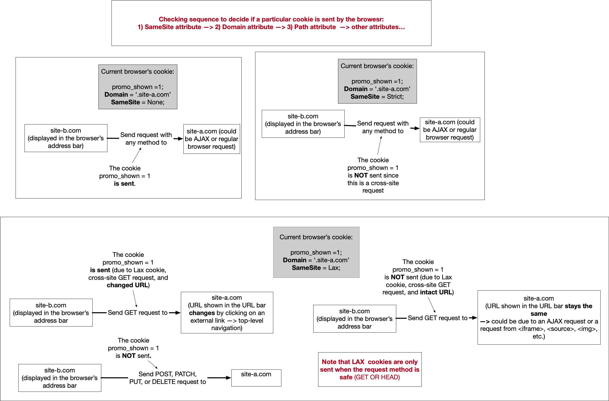
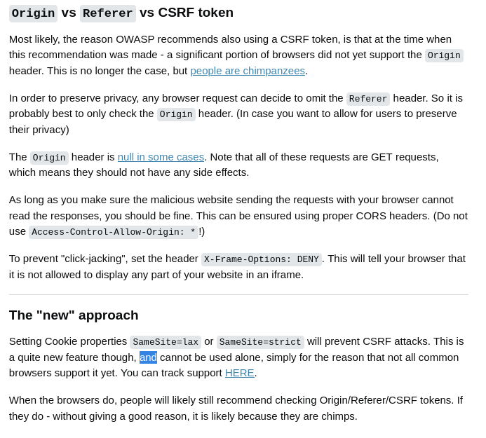

# cross site request forgery

# Same origin policy 

you cannot send request to site from different origin than yourself

exceptions:
* `GET` requests are not guarded
* `POST` - only few content types are allwoed:
  * `application/x-www-form-urlencoded` TODO:why this one
  * `multipart/form-data`
  * `text/plain`
* `SameSite=strict` is an option in cookie - which means the only moment this cookie would be attached to the request is when origin is equal host origin

> [!NOTE]
> `SameSite=strict` vs `SameSite=lax`
> Lax allows the cookie to be sent on some cross-site requests, whereas Strict never allows the cookie to be sent on a cross-site request.
>
> The situations in which Lax cookies can be sent cross-site must satisfy both of the following:
>  * The request must be a top-level navigation. You can think of this as equivalent to when the URL shown in the URL bar changes, e.g. a user clicking on a link to go to another site.
> * The request method must be safe (e.g. GET or HEAD, but not POST).
>
> 

> [!NOTE]
> `Referer` vs `Origin`
> 

> [!NOTE]
> * `secure` cookie is sent only when the connections is secure e.g. `https` 
> * `HttpOnly` cookie - is inaccessible to the JavaScript `document.cookie` API; 

## How to bypass it - Cross Oringin Resource Sharing
* The server gives a permission to some sites to bypass SOP'

- the browsers sends a `OPTION` request from that site:
- the server doesn;t have to respond to this text which means that he blocked that request
- the servers allows to do that by `Access-Control-Allow-Origin: https://b.com` or `Access-Control-Allow-Origin: https://b.com`  - every origin can talk to him

## JSONP and wild czard //TODO: