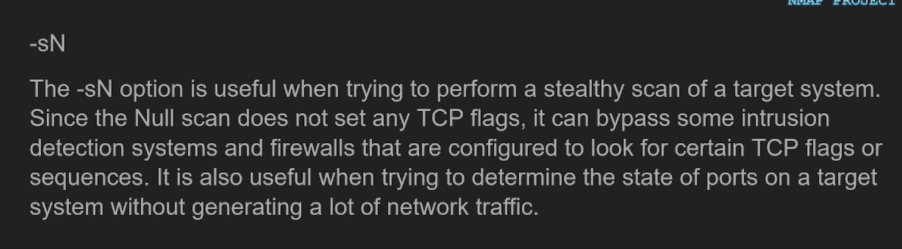

# nmap

before nmap scans a target it pings it and if doens't get reply won't perform a scan. \
in order to disable this behaviour use `-Pn` option

### scan techniques:

**TCP**: 

* `-sT` - TCP handshake, with `RST`
* `-sS` - TCP handshake, without `RST`
* `-sA` - to map out firewall rulesets TODO: how it works
* `-sW` - checks if a TCP port is open, closed or filterd by using the TCP `winodow size` exploit TODO: how it works
* 

**UDP**:

* `-sU` - dns, dhcp. Verys slow

**IDK**

* `-sV` adds information about version of software on some speicific port

* `-sC` - performs a scan script using default set of scripts (some of them are intruvise)

* `--script exploit`

* `os detection`
* 

## how to specify ports
* `-p22`
* `-p1-655535`
* `-p U:53,111,137,T:21-25,80,139,8080,S:9`
* `-p1-5,25`

## port states
* `open`
* `closed`
* `filtered` - its filteered by firewall
* `unfiltered` - port is accessible, but Nmap is unable to determina its state

## time 
`-T<0-5>` - sets timing template (higher is faster)

## spoofing

* `-S <addr>` - changes the source addres (you wont recive replyes)
* `--spoof-mac <addr>`

## output

* `-oN <f>` - simple redirect
* `-oX <f>` - XML output
* `-oG <f>` - greapable output

* `-v` vs `-vv`