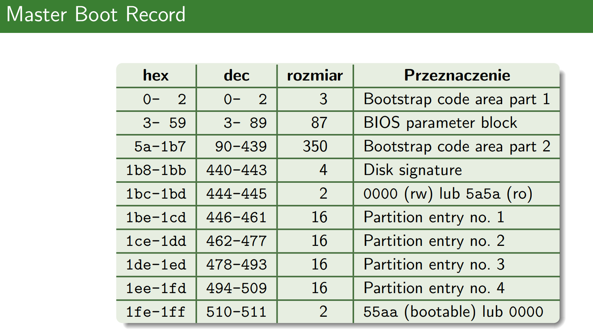
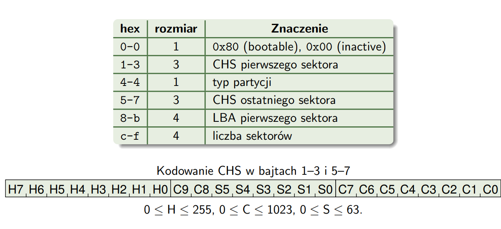
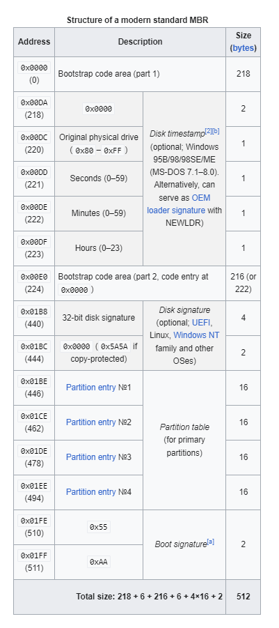
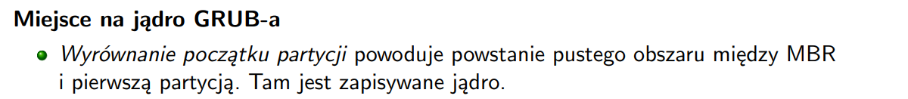

# mbr - master boot record

strucktura zapisana w pierwszym sektorze dysku

bios parameter block zazwyczaj jest pusty

## co robi bios?

1. POST (power-on-self-test)
2. inicjalizacja urządzeń
3. dla dysków w kolejności boot-order:
   1. ładuje sektor MBR do RAM (zawsze pod addres `0x07c00–0x07dff` - zatem wymagana pamiec to 32KiB)
   2. gdy ostatnie bajty to 55aa -  ustawia instruction-pointer na `0x7c00`. wpw - robi to samo z nastpenym dostępnym dyksiem

