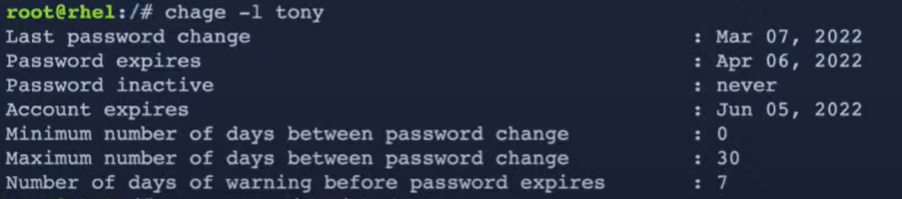
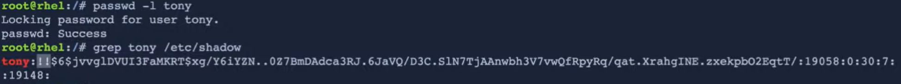
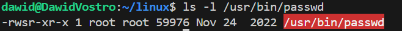

# permissions and groups

## users and groups

`useradd johny`

`passwd johny` - changes johnnys password

`groupadd student` - creates a group

`usermod -aG student tony` - addgroup student to tony

`groups tony` - prints all groups of tony

##  command `chage` *(without n)* 

what should we do if we want to make specific group assigment to expire after specific period of time - use `chage`

`chage -l dawid` - prints info amout expiration dates of some account

`chage -E $(date -d +180days +%Y-%m-%d)`

> [!NOTE]
> 
> `mini number of days btw paswd change` is useful in situatiuon when:
> * identity forbids to change a password to the same password and some persson changes password six time in order to set it to the previous one
>
> * forbiding some hacker to get access to account and change passwrd

`/etc/shadow` the file with hashed passwds of users, and other additional info about account

> [!WARNING]
> `echo admin | passwd -stdin john`
> this command executed as a root allows to automate this job
> but yoiu have to be careful, because it will be visible inot bash history in the root account, but it is not a problem

## how to deal with droping a user

locking passwd: `passwd -l tony`

deleting account (without its home dir): `userdel tony`

deleting account (with its home dir): `userdel tony -r`

## permissions

`chgrp group path` changes groups of some recource on path to group

`chmod g+w path` adds write permission to group of a pathfiles

`chmod o-rw,g+w path` removes read write permission from path

`chmod 660 path`

> [!NOTE]
> only the owner of a file can make changes to its **permissions**

### advanced

`id` - prints groups of current user

suid allow ordinary user to execute some comand with file owner priviledges 

`sgid` on folder means that every file created in that folder group will be that folders group

you can look for files with changed suid with find command

`find . -perm +6000` look for files with `sgid` and `suid`

### ACL - access control list

it's a suplement to others permissions scheme
and allows to set specific user to set specific priviledges

`setfacl`
`getfacl`

