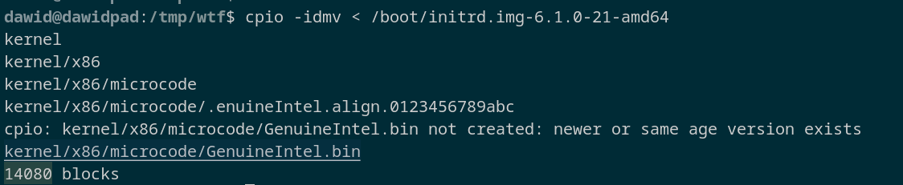
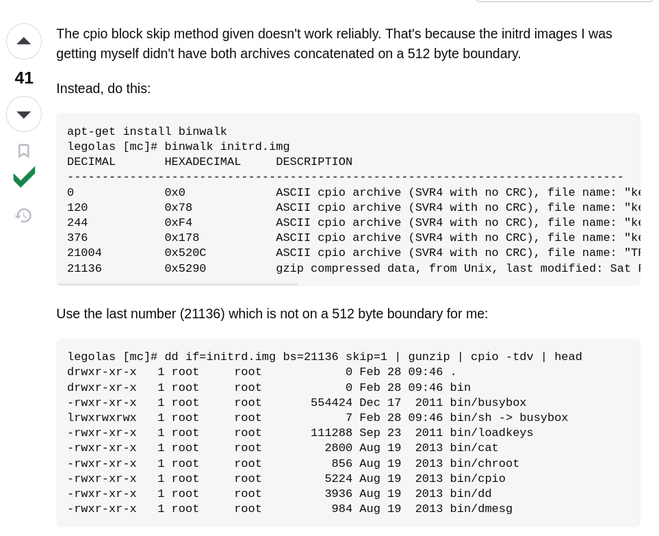

# initramfs

Rozpakowywanie:
`zcat /boot/initrd.img | cpio -i`

Pakowanie:
`find -print0 | cpio --null -v -o --format=newc | gzip -9 > ../initrd.img`

Listowanie zawartości:
`zcat /boot/initrd.img | cpio --extract --quiet --list`
(por. lsinitramfs(1) z pakietu initramfs-tools).

## syf w initramfs`
`zcat /boot/initrd.img-6.1.0-21-amd64 | cpio -i`
zwraca:

`cpio -idmv < /boot/initrd.img-6.1.0-21-amd64`

