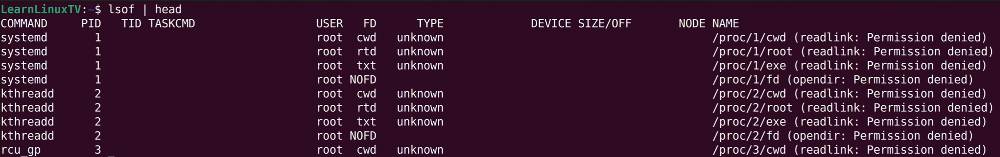

# lsof - list open files

why do we need it:
* how to find file which is open if we want to delete it.
* we found unknown process and want to check his deeds (which file he has opened)

## guide

`lsof -u dawid` reutrn all files opened by dawid

`lsof -c apache2` filter by command

`lsof -p $PID` filter by some pid

`lsof -i 4` polaczenia zareprezenetowane za pomoca pliku

