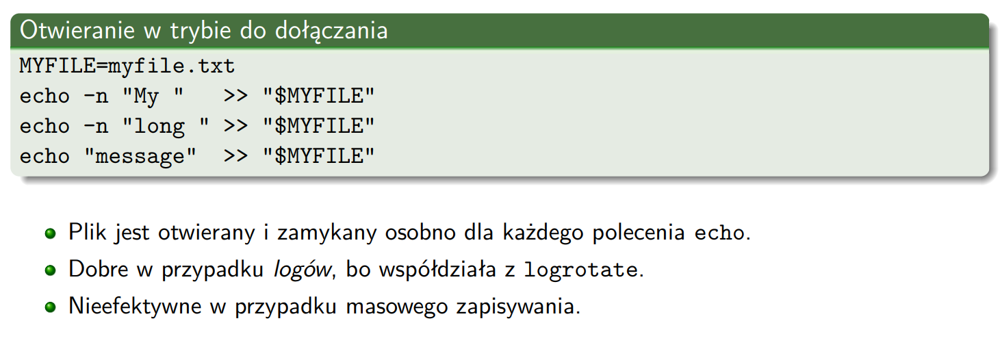
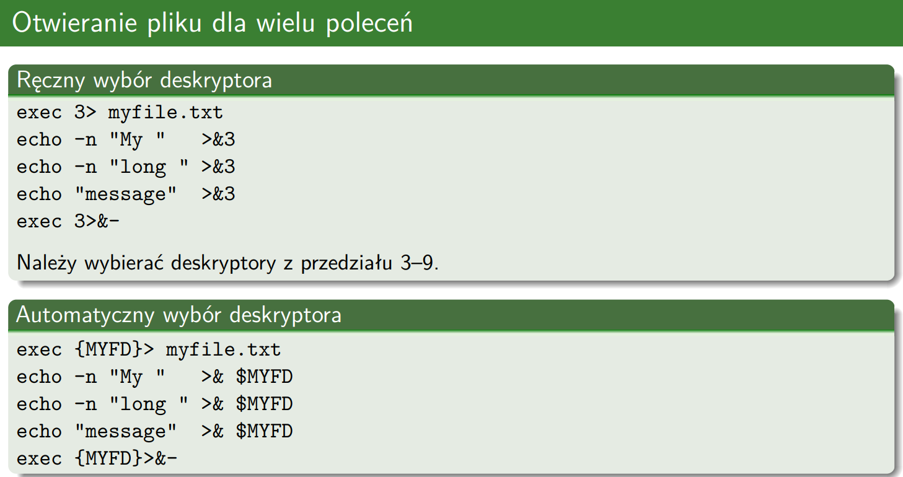

# pipes and redirection
### standard descriptors:
* 0 stdin (&0)

* 1 stdout (&1)

* 2 stderr (&2)

### pipes

`program1 | program2` send stdout from p1 to stdin of p2 with anonymous pipe

### redirections

>sends stdout of program1 to out.log; stderr to terminal\
`program1 1> out.log`\
`program > out.log`\
`program > out.log 2>&1`

>sends stdout and stderr to out.log\
`program1 1> out.log 2> out.log`

>`cat index.txt | program` is equivalent `program < index.txt`

>`program1 < input.txt > output.txt`

### named pipe
`mkfifo my pipe`\
`program > mypipe`\
`program < mypipe`

### special cases
`prog 4> out.log` using special file descriptor in prog to make na output e.g.  write(4, "abc", 3)

> [!NOTE]
> * Redirections `< >` deal with input from files and output to files
> * Pipes `|` deal with input from programs and output of programs

>  [!NOTE]
> `>` and `1>` is the same thing

> [!NOTE]
> `>` puts new file to fd
> `>>` append to the end of a file

## writing to files - descriptor chosing

### 1. file-opening

* we have to reopen file everytime we echo to it
* new file will be created if the provious one name has been changed

### 2. descriptors-chosing

* we have to open file just at the beggining
* same file will be referenced even after name change