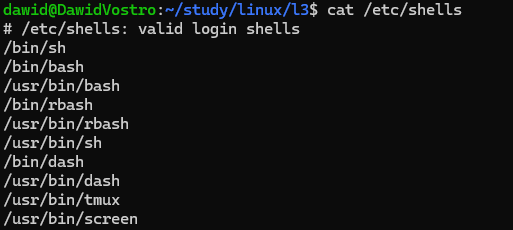

# local account

getting access through OS Credentials Dumping

techniques:

* looking for bash history file
* looking for passwd in etc files
* 

> [!NOTE]
> you can see all shell provided on a system in a file `/etc/shells`
> 

> [!NOTE]
> `gtfobins.github.io` - curated list of unix binarires that can be used to bypass\
> local security restrictions in misconfigured systems

# exploiting SUID & SUDO

# kernel exploits