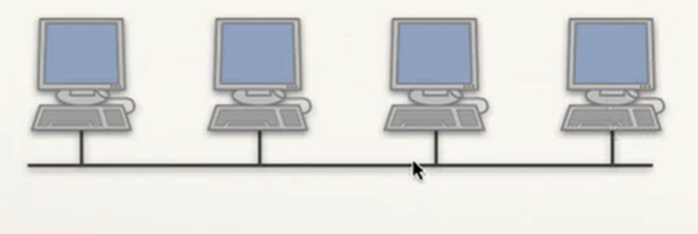
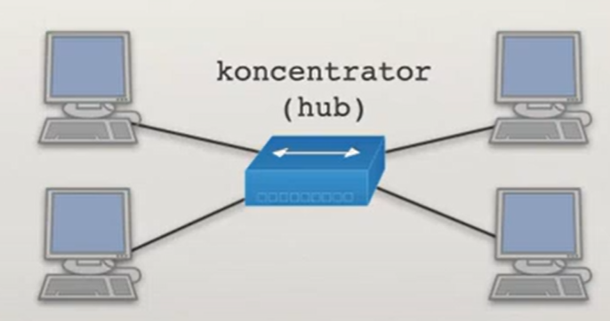

# data link layer

# ethernet

* enables direct commmunication between two devices.
* doesn't ensure reliability of the transmission
  

> [!NOTE]
> some network cards don't show corrupted *frame* to the user, this *frame* is dissmissed. (errors in data transmission are found by menas of error dectenction/correction codes)

## evolution of network topology and shared channels of communication

### one cable topology

* one computer sends frame and everyone recives it
* two computers sends simultaniously -> noone recives msg

### hub topology (better)

## CSMA/CD - collisiion detection 
CA - collision avoidance - acknolwedge system
