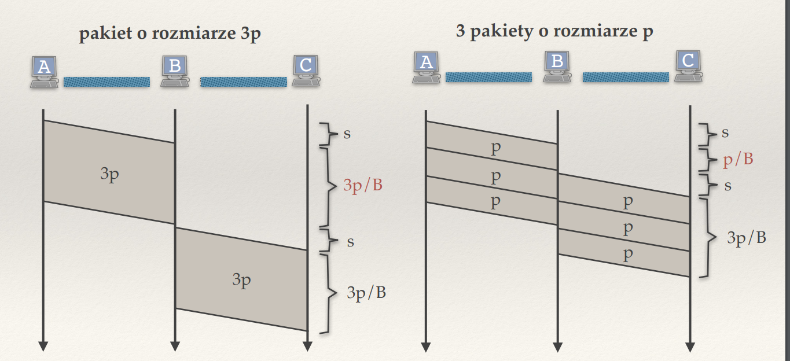
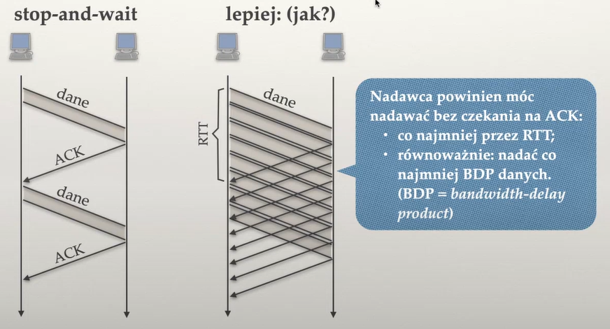
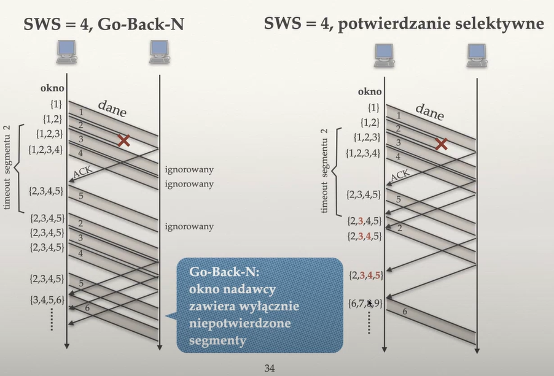

# layer 4

## why do we segment packets

## how to create reliable network protocol
aproches:
1. `ARQ` - **A**utomatic **R**epeat **R**equest `(stop-and-wait)`
   * we  are numbering sent and recived packets
   * we resend packet until we get proper respond from recipient. Then we send another packet
2. `ARQ` - **A**utomatic **R**epeat **R**equest `(sliding window)`
   1. `Go-Back-N`
        * ASDF
   2. `selective acknowledgement`
   3. `cumulation acknowledgement` 

> [!NOTE]
> `selective acknowledgement` vs `cumulation acknowledgement`
> we can delay the ack seding in `cumulation` reducing resources utilized during data transfer

> [!NOTE]
> `SWS` - sliding window size

# TCP

we should create realiablet data transfer not between routers but e2e. Because there will always be some problems in transfer.