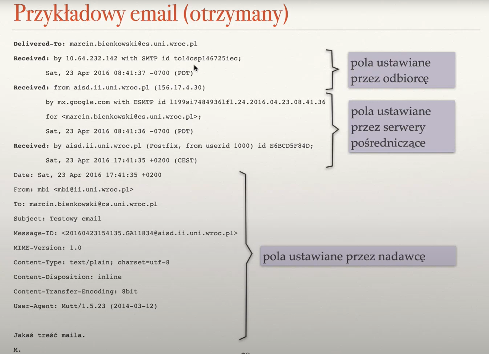
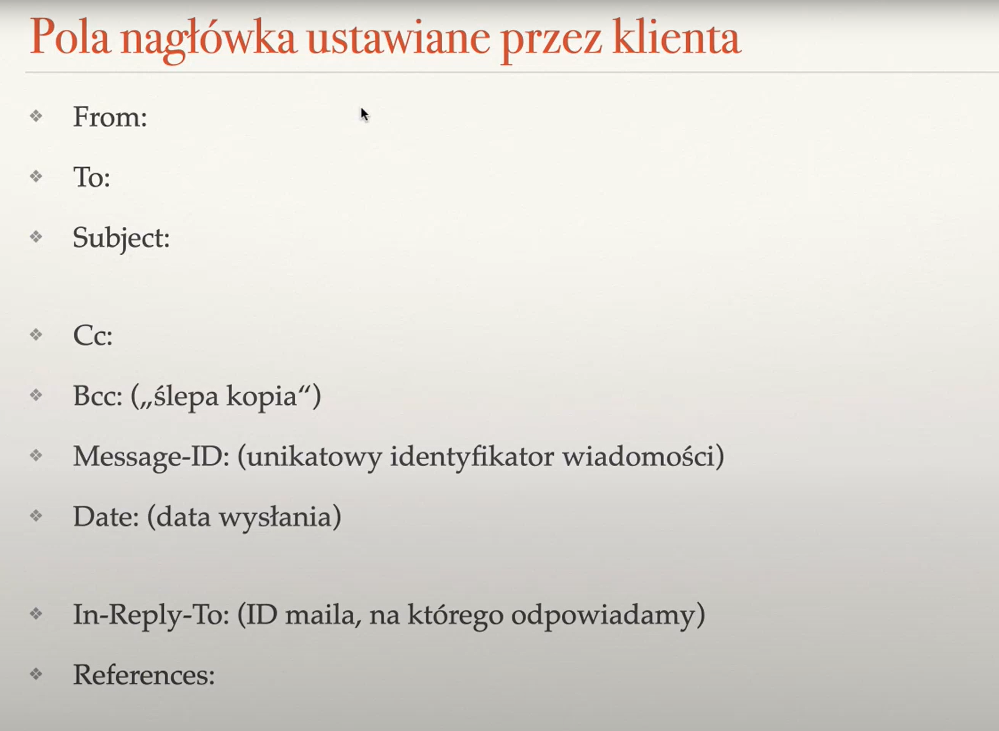
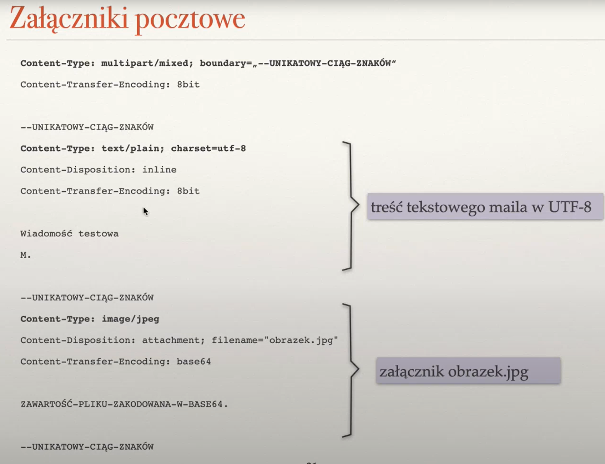
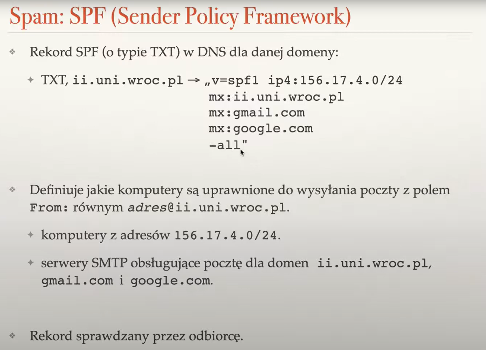

# MAIL

## SMTP
* protokół tekstowy
* wysyłamy maile na odpowiednie servery pocztowe korzystając z rekordów typu `MX` w dns

### ale co jeżeli serwer do którego chcemy wysłać pocztę jest niedostępny?
korzystamy z serwerów pośredniczących, które zajmują się dostarczeniem maila.\
Nazywane są `serwerami SMTP`, `smarthostami`, `SMTP relay` (relay - retransmisja)

### podszywanie się
