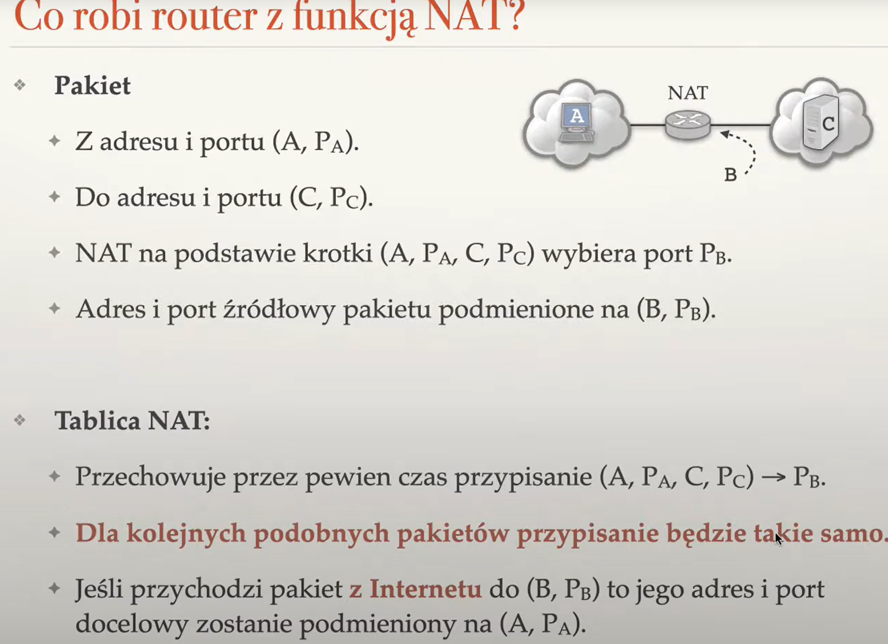
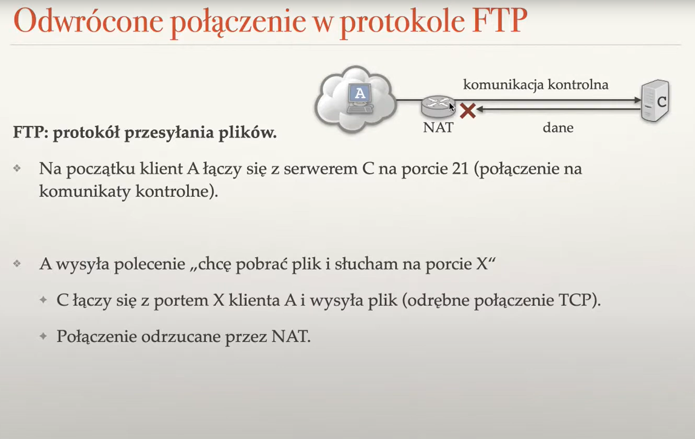
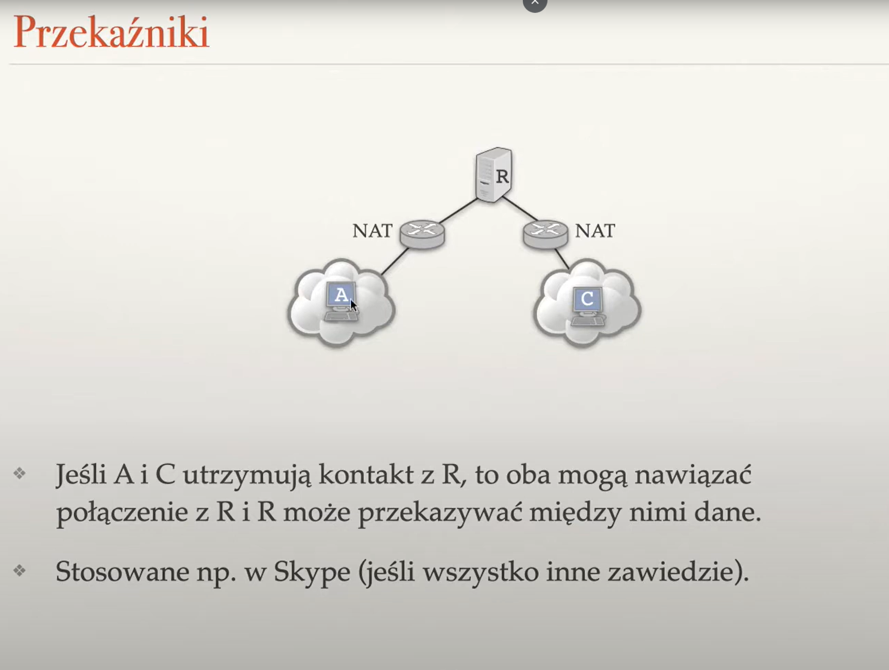

# NAT

### hostorycznie najpierw nat potem p2p

a zatem problem bo nat jest `jednokierunkowy` (nie ma natturalnego sposoby zeby ktoś spoza lokalnej sieci inicjował komunikację się z klientem)

### czyli jak server może zacząć komunikcaję?
- rozwiązanie - korzystamy z aktywnego połącznia z brokerem (który potem nie bedzie uczestniczył w komunickacji). I poprzez brokera prosimhy clienta w lokalnej sieci o rozpoczecie komunikacji
- 

## rodzaje nat:

