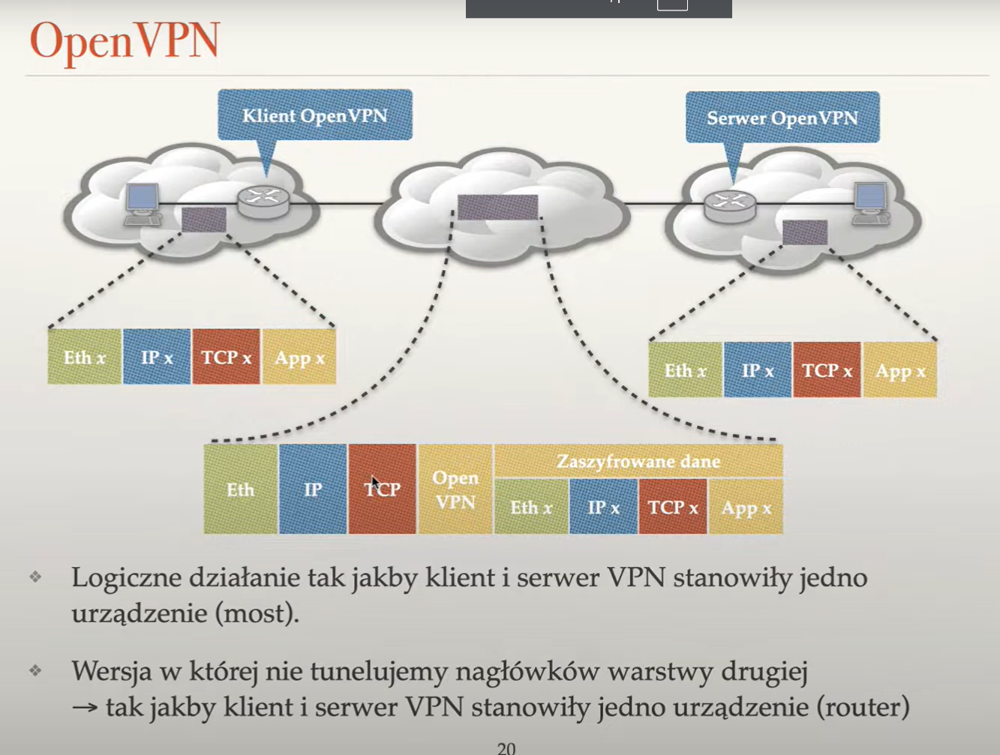

# basic security

### physical layer
#### switch
forcing a `swich` to reconfigure itself into learning mode (by sending lots of packets from the same cable with different ip)

`WPA personal`

### tunneling 

method of sending an ip packet that breaks conventions about encapsulating high level protocol inside the data of lower level protocol `HTTP in TCP in IP` and tunnels ip packet (encrypted) inside tcp packets

### ssh

remote exec:
`ssh <server> "echo 'Dawid'"`

copy file to server
`scp file <server>:/path`

copy file from server
`scp file -r <server>:/path path`

also we can create cheap openvpn with ssh (just on one tcp session)
`ssh -L 4025:localhost:25 user@server`
every message send to 4025 port from origin will be tunneled to localhost:25 in remote machine

### sll heartblead

* effectively we could get content of ram of a server, due to lack of validation of data send by client

### multiple tcp syn attack