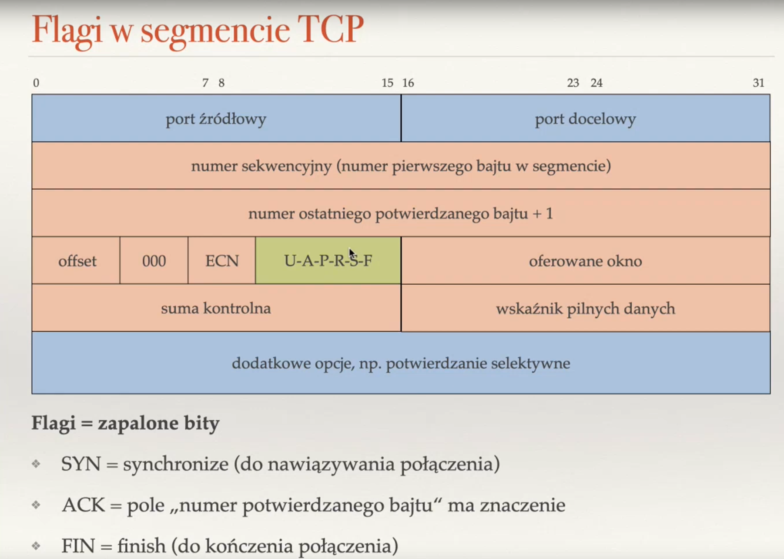
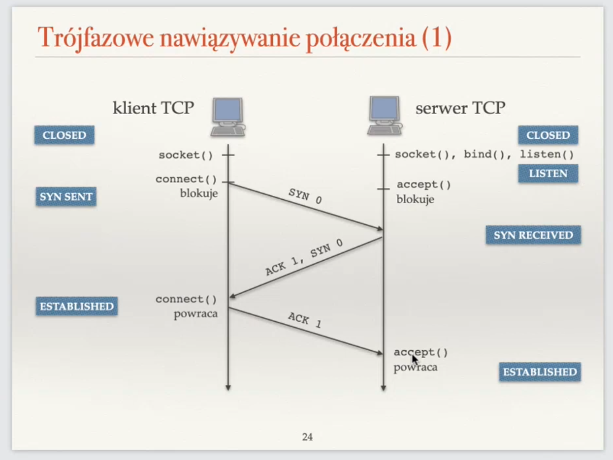
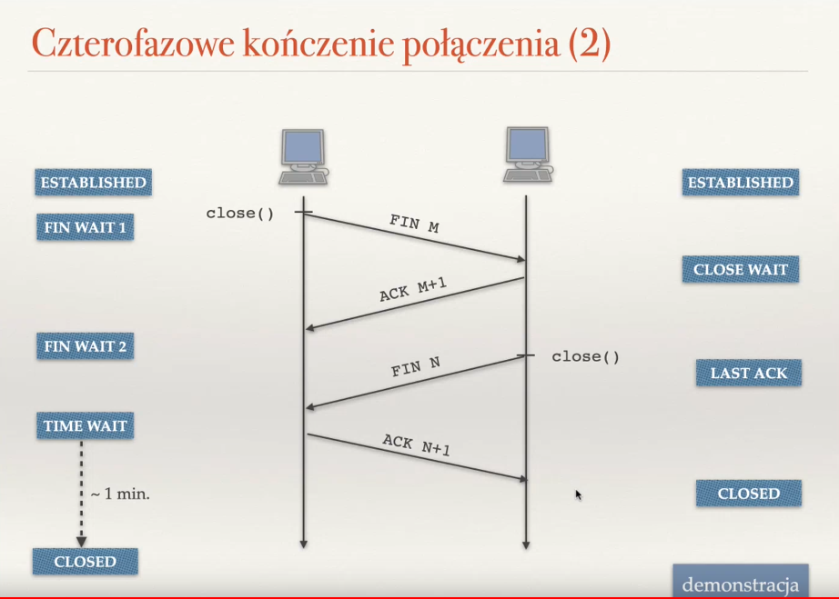

# tcp

## tcp header

* `SYN NUMBER` - sequance number doens't have to be 0 (it is random). Its some weak session hijacking protection 

## why after closing a port it still unable to bind

this process is called `time wait`
which allows a handle a case when last `ack` was lost and the server has to send `FIN` again. 
if the port was closed it would replay `RST` which is unwanted behaviour

> [!NOTE]
> `RST` will close the socket iff it has correct sequential number

> [!TODO]
> napisać aplikacje która robi dos wysyłając rst pod kazdy numer sekeencyjny