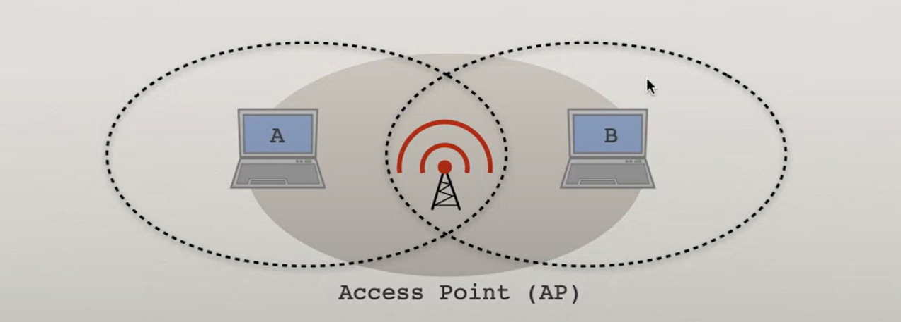

# WLAN

AC (access point) - broker in WLAN

AP rozsyła ramki identyfikacyjne (`beacon frames`) zawierające m.in. nazwę sieci SSID

## "hidden terminal problem"

it can occure mainly if we would apply transmit if noone transmits

* A sends `request to send` to AC (how long would it take)
* AC sends `CTS` to every computer in its range (B also recives it and won't send anything for some period of time)
* A sends frame, and AC acknowledges that (B recvies ackonoledgement)

## technologies

* `WEP` - deprecated
* `WPA` - deprecated
* `WPA2`:
  * perosonal (with pre-shared key common for everyone)
  * enterpriese (distinct authorization server called `RADIUS`)