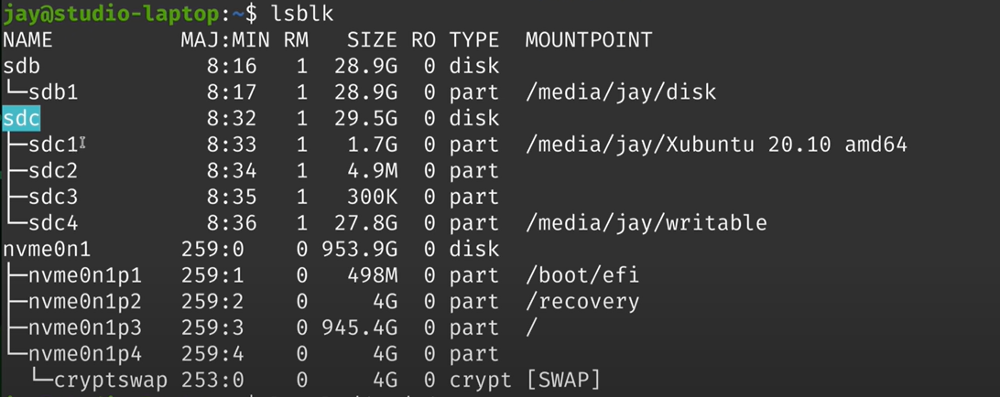
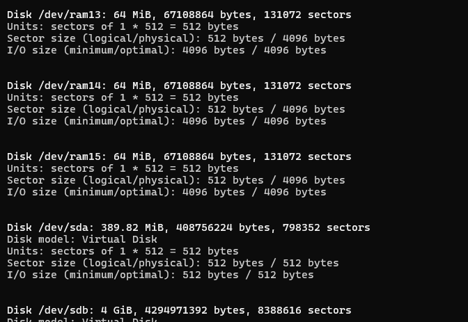

# lsblk
lists all block devices connected to computer

`ls -l /dev/sdc1` just one partition

`ls -l /dev/sdc` whole disk

> [!NOTE]
> nvme  - non-volotile-memory express

# fdisk - format disk
`fdisk -l`
`fdisk devicename` 
options:
* (p)rint info
* print extra (m)enu helper
* create new (g)pt partition table (not a partition)
* craete (n)ew partition table
* (w)rite a changes - make changes final

> [!IMPORTANT]
> dlaczego mój ram jest podzielony na male kawałki?
> 

# mount
`mount` defaultly prints all mounted devices

`umount devicename` `unmount mountpath` unmounts device, but preseves access to it

## where to mount disks?"
* media - for temporary storages like backups hard drives
* mnt - for permanent storages

`mount deviceName pathToMountRoot`

`mount /dev/sdb1 /mnt/disk1`

# how to add file system to partition (make filesystem)
make filesystem

  `mkfs.ext4 -n "label" devicename` - linux extension

  `mksfs.exfat -n "label" devicename` - microsoft extension - cross platform

> [!CAUTION]
> often microsoft extension won't be installed defaultly
> 
> you can install it manually with this command:
> `apt install exfat-utils exfat-fuse`

# ncdu
> [!CAUTION]
> ncdu has access to reasuorces that calling user has

interactive du allows to path travers whole file system and calcules the occupied storage

`sudo ncdu /`
* `-x` only local path

# /etc/fstab
very important file that keeps which devices will be mounted during startup of a system